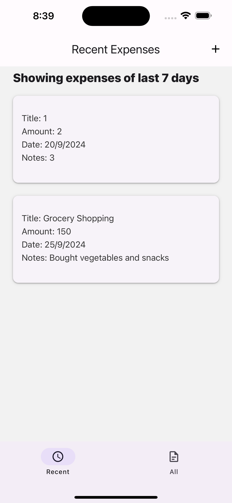
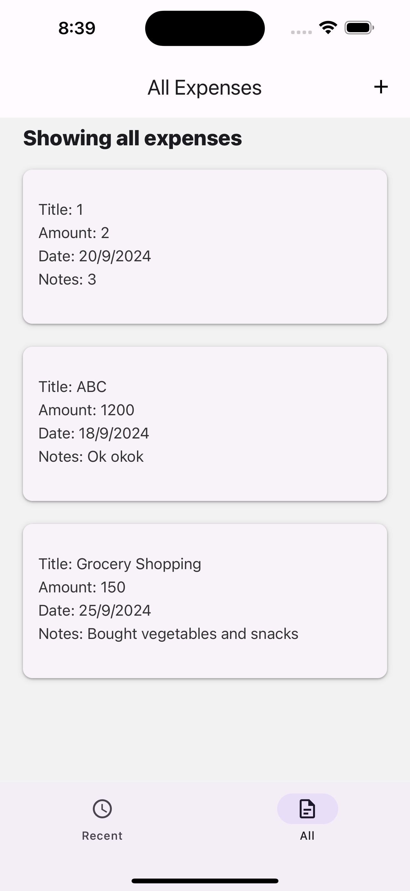
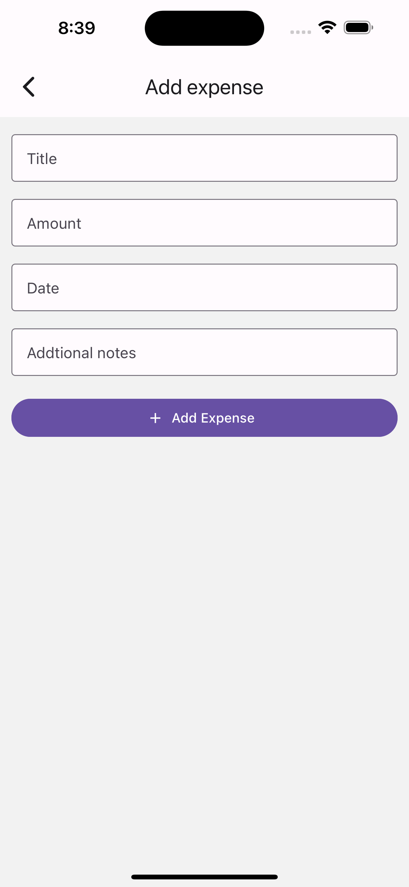

# Expense Tracker App 💸

This **Expense Tracker App** is a simple app built using **React Native**. It allows users to add, view, and track their expenses. Users can view expenses from the last 7 days under the **Recent** tab and all past expenses under the **All** tab.

---

## Features ✨
- **Recent Tab**: Shows expenses from the last 7 days.
- **All Tab**: Displays all expenses recorded by the user.
- **Add Expense**: Allows the user to quickly add a new expense with details such as amount, description, and date.
- Basic UI that works on both Android and iOS.

---

## Screenshots 📸

### 1. Recent Expenses Screen


### 2. All Expenses Screen


### 2. Add Expense Screen


---

## How to Run 🏃‍♂️

1. Clone the repository:
    ```bash
    git clone https://github.com/anirudhsingh8/ExpenseTracker.git
    ```

2. Navigate to the project directory:
    ```bash
    cd ExpenseTracker
    ```

3. Install dependencies:
    ```bash
    npm install
    ```

4. Run the app on an Android or iOS simulator:
    ```bash
    npm start
    ```

---

## Concepts Used 💡
- **Tabs Navigation**: Implemented tab navigation for switching between recent and all expenses.
- **State Management**: Used `useState` and `useEffect` to manage expenses and filter them by date.
- **Dynamic Rendering**: Displayed lists of expenses dynamically based on date range.
- **Input Handling**: Used form elements for adding new expenses with proper validation.